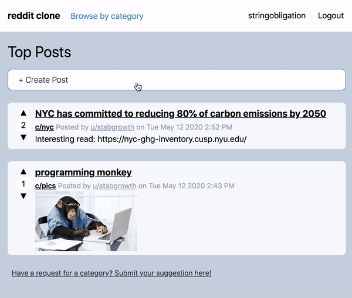

   

# Reddit Clone
## Overview
A web app based off of the social news discussion site, Reddit. Visitors of the site can view relevant posts under broad categories such as programming and pictures. Users can create their own text/image posts, as well as upvote or downvote posts to express which posts they like or dislike. The most popular posts will be shown on the homepage. On any post, users can also add comments.

## Demo
Here is a working live demo: https://jennarim-reddit-clone.herokuapp.com/

## Features

* Submit texts posts and images relevant to categories such as programming and pics

* Comment on posts that other users have made
* Vote on posts to express posts you like or dislike
* View posts a specific user made
* Register/Login - Easily create an account to use features such as posting, commenting, and voting

## Built with
* [Express](https://expressjs.com/) - Web application framework for Node.js

* [MongoDB](https://www.mongodb.com/) - NoSQL Database 

* [tailwind.css](https://tailwindcss.com/) - Highly customizable, CSS framework

* [Passport.js](http://www.passportjs.org/) -  Authentication middleware for Node.js
      * used to support user registration/login functionality

* [Constraint Validation API](https://developer.mozilla.org/en-US/docs/Web/API/Constraint_validation) - Client side form validation
