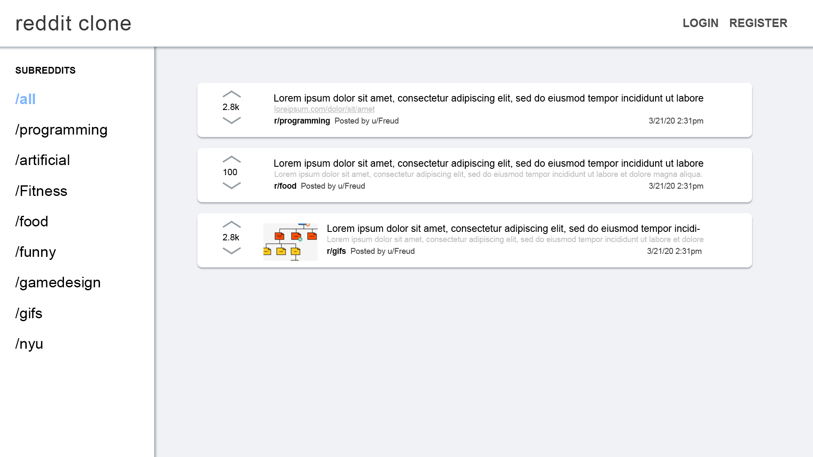
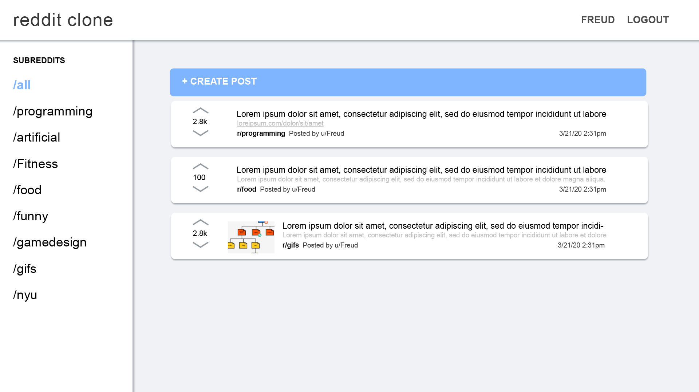
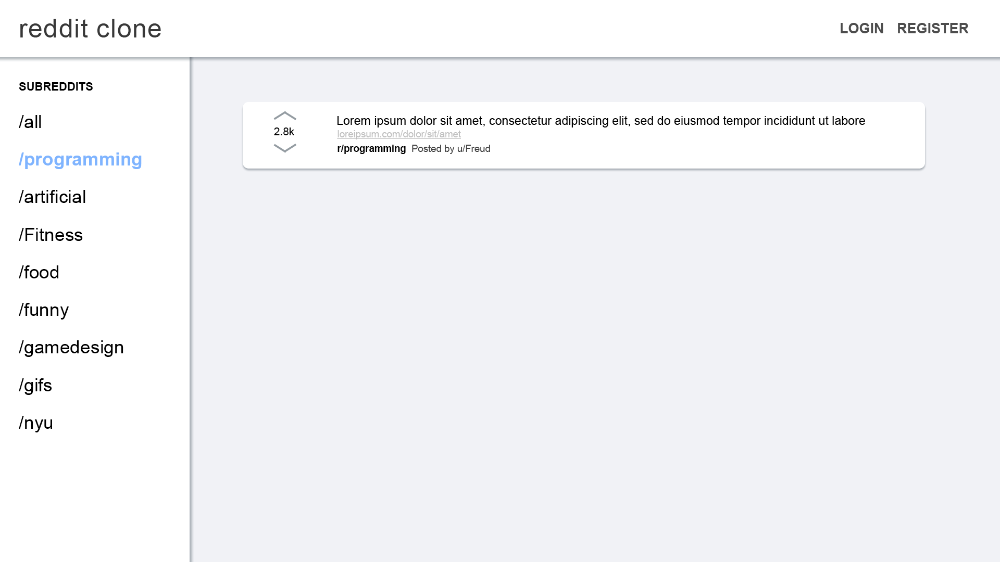
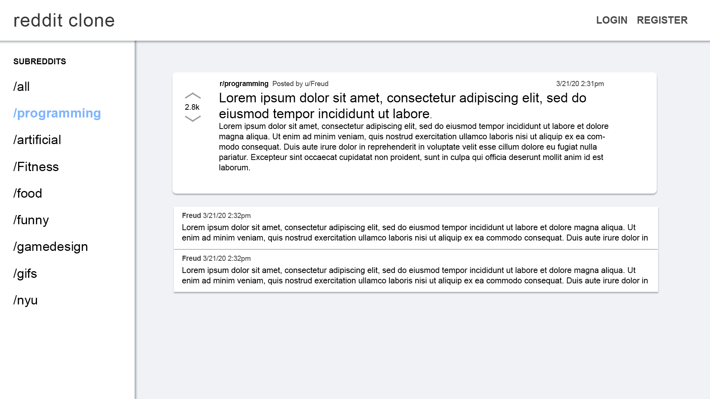
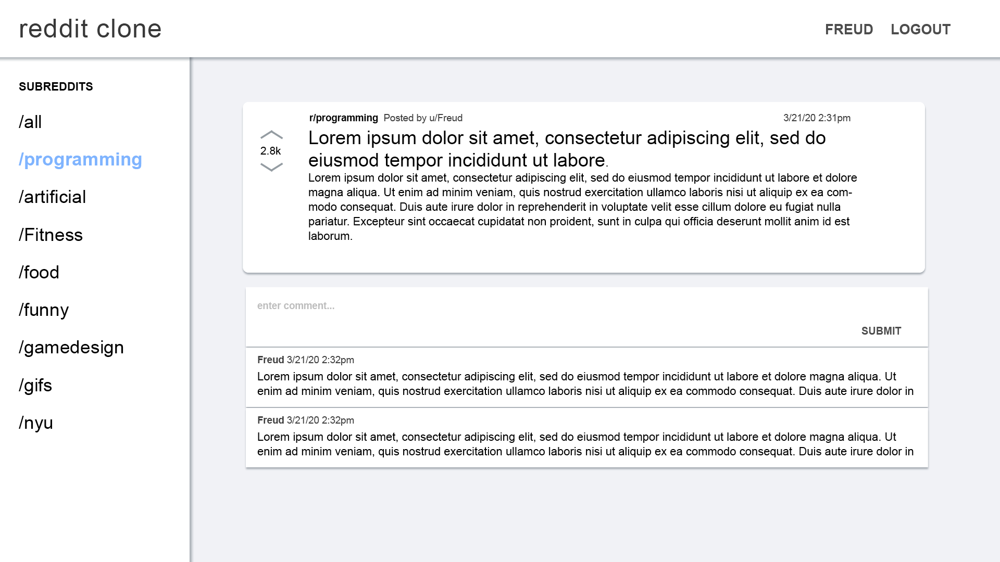
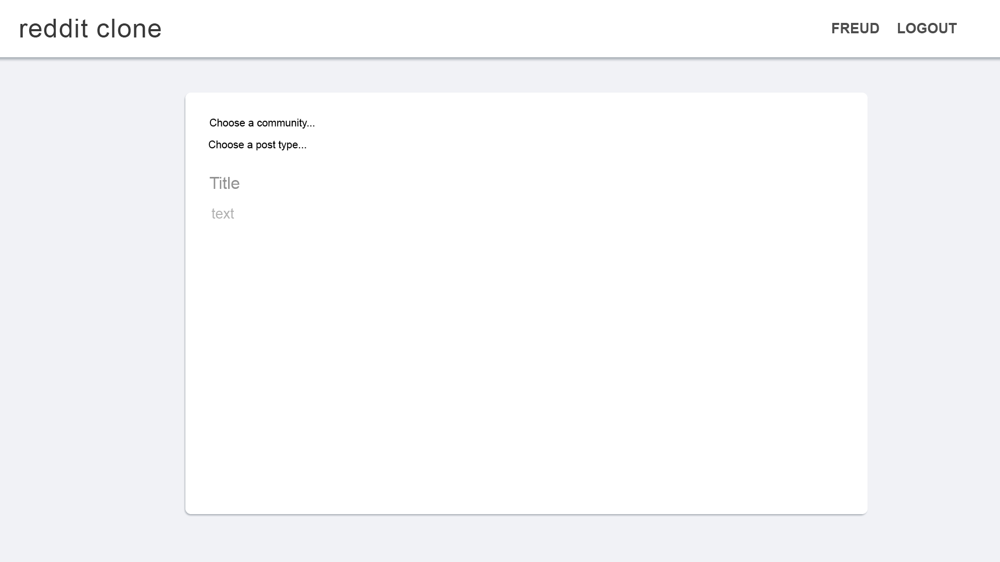
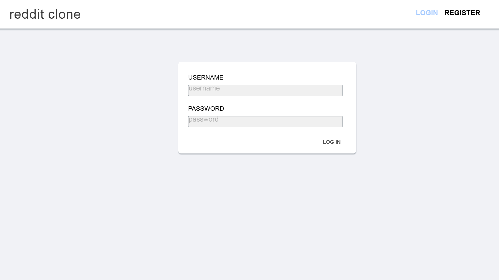
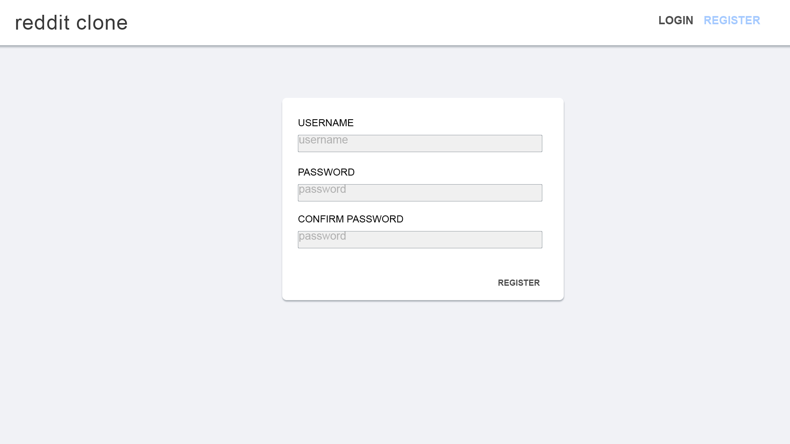
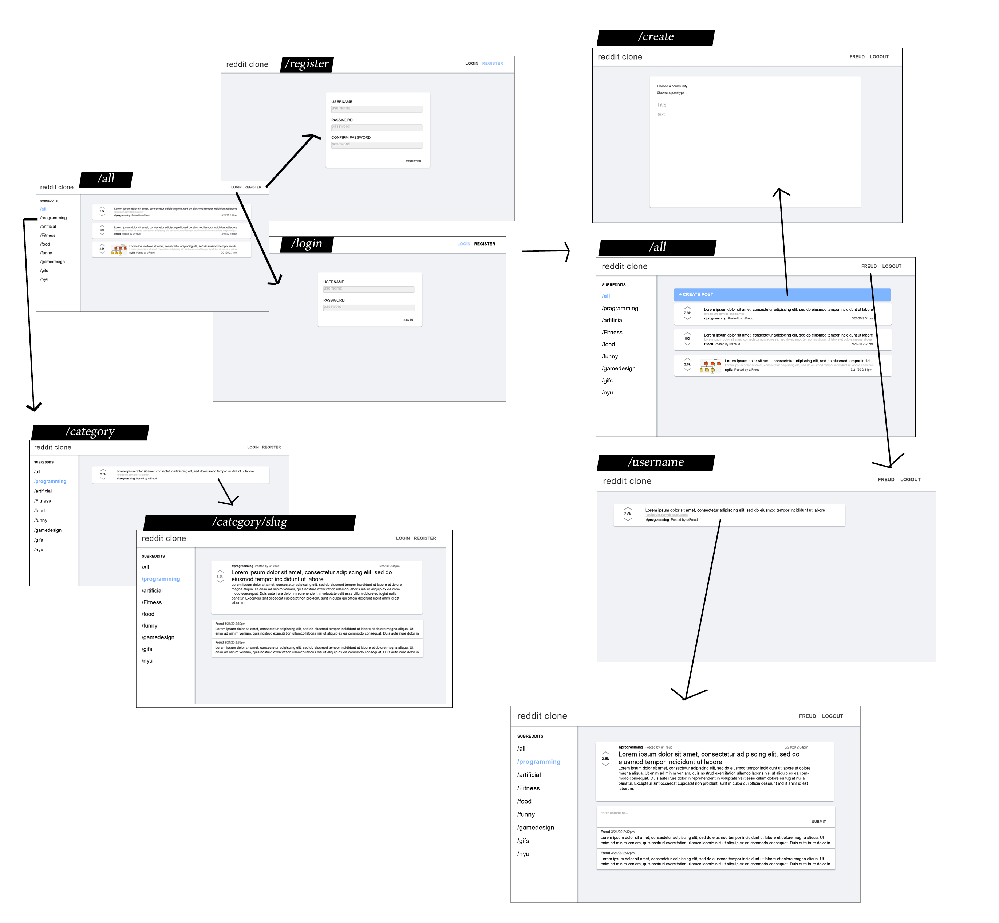

# Reddit Clone

## Overview

<!-- (___TODO__: a brief one or two paragraph, high-level description of your project_) -->
Reddit Clone is a web app based off of the social news discussion site, Reddit. Visitors of the site can view relevant posts under broad categories such as programming and food. Users can register and login to create their own link/text/photo posts. Users can also access their profile, where they will be able to see the posts they have made. 

Time permitting, comments can be made by users under every post. 

## Data Model

<!-- (___TODO__: a description of your application's data and their relationships to each other_) -->
The application will store Categories, Users, and Posts.
* Categories can contain multiple Posts (added via user forms)
* Users can make Posts. 

<!--
The application will store Categories, Users, Posts and Comments.
* Categories can contain multiple Posts (added via user forms)
* Posts can contain multiple Comments.
* Users can make Posts and Comments. 
-->


<!--(___TODO__: sample documents_) -->

An Example User:

```javascript
{
  username: "freud",
  hash: // a password hash,
  posts: // an array of references to Post documents
}
```

An Example Post:

```javascript
{
  category: "programming",
  title: "Benefits to JavaScript?",
  type: // string with value link, text, or img,
  body: // string with value of url, text, or img
  username: "freud",
  createdAt: // timestamp
}
```
<!-- comments: // an array of references to Comment documents -->

<!-- An Example Comment: 
```javascript
{
  post: // reference to specific Post document,
  username: // name of user who made comment,
  text: // content of comment
}```
-->

An Example Category with Embedded Posts:

```javascript
{
  name: "programming",
  posts: [
    { category: "programming", title: "Benefits to JavaScript?", type: "text", body: "There are a lot!", username: "freud", createdAt: // timestamp },
    { category: "programming", title: "Video on why I love to code", type: "link", body: "www.youtube.com/why-i-love-to-code", username: "marth", createdAt: // timestamp }
  ],
  active: true // is user viewing this category?
}
```

<!--
An Example Subreddit with Embedded Posts:
```javascript
{
  user: // a reference to a User object
  name: "Breakfast foods",
  items: [
    { name: "pancakes", quantity: "9876", checked: false},
    { name: "ramen", quantity: "2", checked: true},
  ],
  createdAt: // timestamp
}
``` 
-->

## [Link to Commented First Draft Schema](src/db.js) 

<!-- (___TODO__: create a first draft of your Schemas in db.js and link to it_) -->

## Wireframes

<!-- (___TODO__: wireframes for all of the pages on your site; they can be as simple as photos of drawings or you can use a tool like Balsamiq, Omnigraffle, etc._) -->

/all - main page that shows all posts from all categories  
Anonymous User POV

Logged in User POV


/\<category-name\> - page that shows all posts of specified category  
e.g. /programming


/\<category-name\>/\<post-slug\> - page that shows specific post of specified category  
e.g. /programming/lorem-ipsum
Anonymous User POV

Logged in User POV


/create - page to create a post


/login - page to login


/register - page to register


Note: Shown in the wireframes are features such as upvote scores and comments. These features will only be implemented when the base work is done. 

## Site map



<!-- (___TODO__: draw out a site map that shows how pages are related to each other_)

Here's a [complex example from wikipedia](https://upload.wikimedia.org/wikipedia/commons/2/20/Sitemap_google.jpg), but you can create one without the screenshots, drop shadows, etc. ... just names of pages and where they flow to. -->

## User Stories or Use Cases

<!-- (___TODO__: write out how your application will be used through [user stories](http://en.wikipedia.org/wiki/User_story#Format) and / or [use cases]( -->https://www.mongodb.com/download-center?jmp=docs&_ga=1.47552679.1838903181.1489282706#previous)_)

1. As a non-registered user, I can register a new account.
2. As a non-registered user, I can view posts of any category.
3. As a user, I can log in to the site.
4. As a user, I can view posts of any category.
5. As a user, I can create posts to be uploaded to any category.

## Research Topics

<!-- (___TODO__: the research topics that you're planning on working on along with their point values... and the total points of research topics listed_) -->

* (5 points) Integrate user authentication
    * Passport - authentication middleware for Node.js for Express-based web apps
      * will be used to support username + password functionality for the site
        - specifically using [this module](http://www.passportjs.org/docs/username-password/)
  <!--   * I'm going to be using passport for user authentication
    * And account has been made for testing; I'll email you the password -->
<!--     * see <code>cs.nyu.edu/~jversoza/ait-final/register</code> for register page
    * see <code>cs.nyu.edu/~jversoza/ait-final/login</code> for login page -->
* (4 points) Perform client side form validation using a JavaScript library
    * [Constraint Validation API](https://developer.mozilla.org/en-US/docs/Web/API/Constraint_validation) - checks for valid form input on client-side before the values are submitted to the server
      * will be used to ensure that invalid inputs such as empty fields, inclusion of special characters, etc will not be submitted to the server
* (2 points) Use a CSS framework throughout your site, use a reasonable of customization of the framework
    * CSS framework - gives a basic structure 
    * Possible solutions:
      * [Bulma](https://bulma.io/) - readable class names, pure CSS (no JS)
      * [Bootstrap](https://getbootstrap.com/) - low learning curve
      * [Foundation](https://foundation.zurb.com/) - easily customizable

11 points total out of 8 required points <!--(___TODO__: addtional points will __not__ count for extra credit_)-->


## [Link to Initial Main Project File](src/app.js) 

<!-- (___TODO__: create a skeleton Express application with a package.json, app.js, views folder, etc. ... and link to your initial app.js_)
 -->
## Annotations / References Used

<!-- (___TODO__: list any tutorials/references/etc. that you've based your code off of_) -->

<!-- 1. [passport.js authentication docs](http://passportjs.org/docs) - (add link to source code that was based on this)
2. [tutorial on vue.js](https://vuejs.org/v2/guide/) - (add link to source code that was based on this) -->

