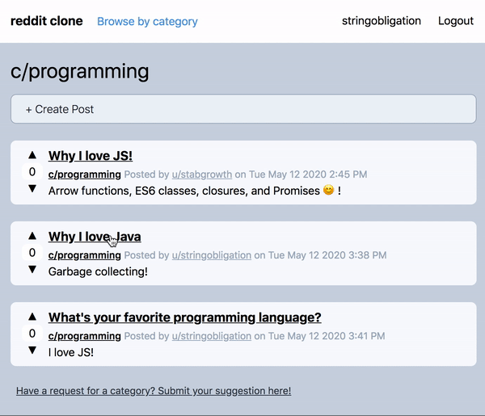
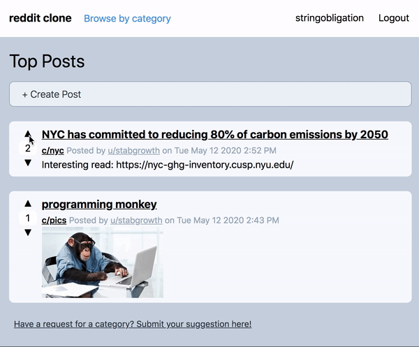
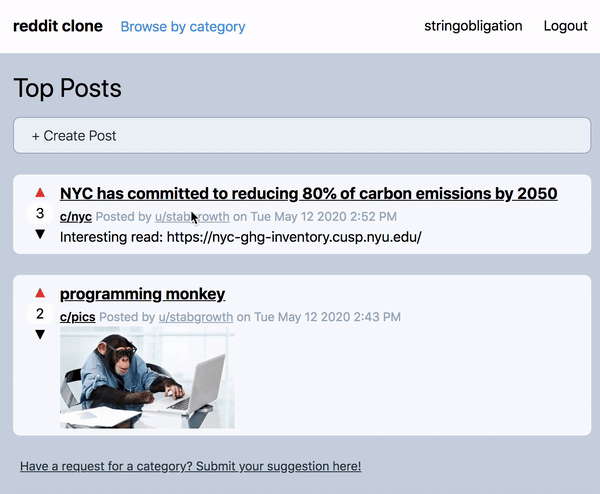
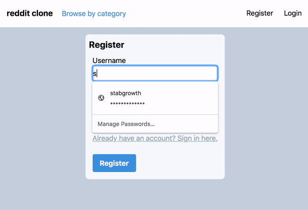

   

# Reddit Clone
A web application based off of the social news discussion site, Reddit, in which users can post, comment, and vote. Built with Node.js (Express, MongoDB).

## Table of Contents
* [Demo](#demo)
* [Key Features](#key-features)
* [Built with](#built-with)
* [Project Status](#project-status)

## Demo
Here is a working live demo: https://jennarim-reddit-clone.herokuapp.com/

## Key Features
* Submit text/image posts relevant to categories such as programming and pics

* Comment on posts that other users have made

* Vote on posts to express posts you like or dislike

* View posts a specific user made  

* Register/Login - Easily create an account to use features such as posting, commenting, and voting

**To-do**
* Delete posts/comments
* Support links as a post type
* Vote on comments
* View voted posts

## Built with
* [Express](https://expressjs.com/) - Web application framework for Node.js
* [MongoDB](https://www.mongodb.com/) - NoSQL Database 
* [tailwind.css](https://tailwindcss.com/) - Highly customizable, CSS framework
* [Passport.js](http://www.passportjs.org/) -  Authentication middleware for Node.js
  * used to support user registration/login functionality
* [Constraint Validation API](https://developer.mozilla.org/en-US/docs/Web/API/Constraint_validation) - Client side form validation

## Project Status
This project is currently finished, but has a few extra features to be developed further (see To-do). 
